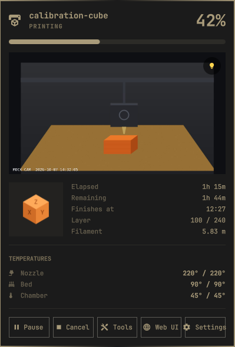
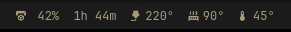
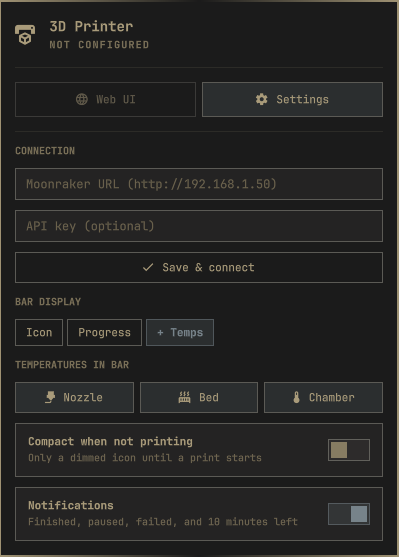
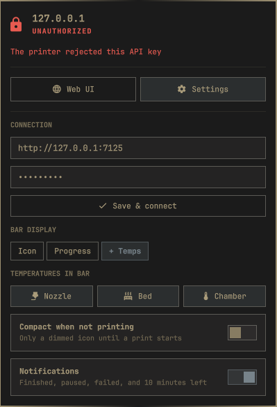
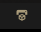
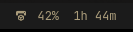
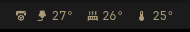

# Moonraker Printer for Omarchy

A bar widget for the [Omarchy](https://omarchy.org) shell that shows the status
of any Klipper 3D printer running [Moonraker](https://github.com/Arksine/moonraker):
Qidi (tested on a Q2), Voron, RatRig, Creality K-series with Klipper, and others.

<p align="center">
  
</p>
<p align="center">
  
</p>

## Features

- **Bar chip** in three styles: icon only, progress + time left, or progress + temperatures
- **Detail popup**: thumbnail, elapsed/remaining time, finish time, layer, filament, live temperatures
- **Printer camera** in the popup, from the webcam set up in Mainsail/Fluidd. It
  refreshes about once a second and only while the popup is open, so nothing runs in the background
- **Filament changer** (AFC: Elegoo Canvas, Box Turtle, Night Owl, …): every
  lane with its color, tool, material, and remaining weight, which one is in the
  toolhead, and a live view of tool changes: old → new filament, unload / load /
  resume, and "change 3 of 12" during multi-color prints. The bar chip shows the
  target tool while a change runs
- **Controls**: pause, resume, and cancel (cancel asks you to confirm)
- **Every printer state is covered**: setup, unreachable, bad API key, Klipper
  starting/shutdown/disconnected, idle, heating, printing, paused, complete,
  cancelled, and error. See [docs/STATES.md](docs/STATES.md).
- **API key support**: works over a VPN or anywhere the printer doesn't trust your IP
- **Native look**: colors, font, borders, and controls come from the Omarchy
  shell, so the widget follows `omarchy theme set` like the built-in widgets
- **Bounded and lightweight**: one short `curl` call per request (curl ships with every Arch install), capped at 1 MB and 10 seconds, so a misbehaving printer can't stall or bloat your shell

## Install

```bash
omarchy plugin add https://github.com/prodpixa/omarchy-moonraker.git --enable
```

Or manually:

```bash
git clone https://github.com/prodpixa/omarchy-moonraker.git ~/.config/omarchy/plugins/io.github.prodpixa.moonraker
omarchy-shell shell rescanPlugins
omarchy plugin enable io.github.prodpixa.moonraker right
```

Then click the printer icon in the bar. The popup opens on the Settings form.
Enter the Moonraker URL (and the API key if your printer needs one), then click
**Save & connect**.

<p align="center">
  
  &nbsp;
  
</p>

### Finding the API key

- Mainsail / Fluidd: *Settings → Authorization → API key*
- From a machine the printer already trusts: `curl http://<printer>/access/api_key`

The key is only needed when Moonraker doesn't trust your address, e.g. over a
VPN or from another subnet. On the same LAN many printers work without one.

## Uninstall

```bash
omarchy plugin remove io.github.prodpixa.moonraker
```

This removes the widget from the bar, deletes its settings (including the API
key) from `~/.config/omarchy/shell.json`, and deletes the plugin folder.
`omarchy plugin disable io.github.prodpixa.moonraker` also removes the widget and its settings
but keeps the folder.

## Using it

| Action        | Result |
|---------------|--------|
| Left click    | Open or close the detail popup |
| Right click   | Cycle the bar style: icon → progress → progress + temps |
| Middle click  | Open the printer's web UI (Mainsail/Fluidd) in your browser |
| `r` / `s` / `o` in the popup | Refresh / toggle settings / open the web UI |
| `Esc`         | Close the popup |

### Bar styles

| Style | Example |
|-------|---------|
| `icon` |  |
| `progress` |  |
| `full` |  |
| `full` while idle |  |
| any style, idle, with **Compact when not printing** |  |

When the printer is offline the icon dims and changes to a network-disconnect
glyph. Auth problems show a lock. Klipper problems and print errors switch the
chip to your theme's urgent color.

## Configuration

The Settings section in the popup writes these values to the widget's entry in
`~/.config/omarchy/shell.json`. You can also edit that file by hand:

```json
{
  "id": "io.github.prodpixa.moonraker",
  "url": "http://192.168.1.50",
  "apiKey": "",
  "display": "full",
  "temps": ["nozzle", "bed", "chamber"],
  "pollInterval": 5,
  "compactWhenIdle": false,
  "hideWhenIdle": false,
  "hideWhenOffline": false,
  "chamberObject": "",
  "showCamera": true,
  "webcam": "",
  "showFilament": true
}
```

| Key               | Default             | Description |
|-------------------|---------------------|-------------|
| `url`             | —                   | Moonraker address. `http://` is added when missing. Include the port if it isn't 80, e.g. `http://printer.local:7125`. |
| `apiKey`          | `""`                | Sent as the `X-Api-Key` header. |
| `display`         | `progress`          | `icon`, `progress`, or `full`. |
| `temps`           | `["nozzle","bed"]`  | Temperatures shown in `full` style: `nozzle`, `bed`, `chamber`. |
| `pollInterval`    | `5`                 | Seconds between refreshes (2–120). Capped at 3 s while printing or while the popup is open. |
| `compactWhenIdle` | `false`            | Show only a dimmed icon while nothing is printing. The widget stays clickable. This is the toggle in the popup. |
| `hideWhenIdle`    | `false`             | Hide the widget completely until a print starts. Because the settings live in the widget's popup, this one is only available in `shell.json` or over IPC. To show the widget again: `omarchy-shell io.github.prodpixa.moonraker configure '{"hideWhenIdle":false}'`. |
| `hideWhenOffline` | `false`             | Hide the widget while the printer can't be reached. |
| `chamberObject`   | auto                | Klipper object for the chamber temperature, e.g. `temperature_sensor chamber`. Detected automatically when empty. |
| `showCamera`      | `true`              | Show the printer's webcam in the popup. The toggle appears in Settings when the printer has a webcam. |
| `webcam`          | first one           | Name of the webcam to show, as set in Mainsail/Fluidd. With several webcams, click the picture to switch. |
| `showFilament`    | `true`              | Show the filament changer's lanes and tool changes. Only has an effect on printers with [AFC](https://github.com/ArmoredTurtle/AFC-Klipper-Add-On). |

The API key is stored in plain text in `shell.json`, like every other Omarchy widget setting.

## Scripting (IPC)

```bash
omarchy-shell io.github.prodpixa.moonraker toggle          # open/close the popup
omarchy-shell io.github.prodpixa.moonraker showSettings    # open the popup on the settings form
omarchy-shell io.github.prodpixa.moonraker refresh         # poll now
omarchy-shell io.github.prodpixa.moonraker cycleDisplay    # next bar style
omarchy-shell io.github.prodpixa.moonraker status          # JSON snapshot (never includes the API key)
omarchy-shell io.github.prodpixa.moonraker configure '{"url":"http://printer","display":"full"}'
```

`status` output:

```json
{
  "configured": true, "online": true, "auth": true, "klippy": "ready",
  "state": "printing", "file": "benchy.gcode", "progress": 0.42, "remaining": 6720,
  "temps": {
    "nozzle": {"key": "nozzle", "temperature": 219.6, "target": 220},
    "bed": {"key": "bed", "temperature": 60.1, "target": 60}
  },
  "error": "",
  "filament": {
    "loaded": "CANVAS_1", "state": "Idle", "changing": false, "from": "", "to": "", "step": "",
    "toolchange": 0, "toolchanges": 0, "error": false, "message": "",
    "lanes": [
      {"name": "CANVAS_1", "tool": "T0", "material": "PETG", "color": "#212121", "weight": 980.4, "ready": true, "loaded": true},
      {"name": "CANVAS_2", "tool": "T1", "material": "TPU", "color": "#ffffff", "weight": 0, "ready": true, "loaded": false}
    ]
  },
  "camera": {
    "enabled": true, "webcams": ["webcam"], "active": "webcam",
    "snapshot": "/webcam/?action=snapshot", "url": "http://192.168.1.50:8080/?action=snapshot",
    "streaming": true, "error": ""
  }
}
```

`filament` is `null` on printers without AFC. `camera.url` is the snapshot address that answered, after resolving relative
URLs and same-host redirects. `streaming` is true only while the popup is open.

The real output is a single line.

## Troubleshooting

| Popup says | Meaning / fix |
|------------|---------------|
| *Not configured* | No URL set. Open Settings. |
| *Unreachable — No response from …* | Wrong address or port, the printer is off, or the VPN is down. Try the URL in a browser. |
| *Unauthorized — This printer requires an API key* | Moonraker doesn't trust your IP. Add the API key. |
| *Unauthorized — The printer rejected this API key* | The key is wrong or was regenerated. |
| *Klipper disconnected / shutdown / starting up* | Moonraker is fine, Klipper isn't. Check the printer's screen or web UI. The message from Klipper is shown under the title. |
| No chamber temperature | Set `chamberObject` to the right Klipper object (see `/printer/objects/list`). |
| No thumbnail | The slicer didn't embed one, or Moonraker didn't extract it. |
| No filament section | The printer has no [AFC](https://github.com/ArmoredTurtle/AFC-Klipper-Add-On) object. Happy Hare / ERCF and other changers aren't supported yet. |
| Lane weight missing | AFC doesn't know it: set the spool weight in AFC or Spoolman. |
| No camera | No enabled webcam is set up in Mainsail/Fluidd, or its service only streams (WebRTC, HLS) and has no snapshot URL. |
| *HTTP 302 → …* under the camera | The snapshot URL redirects to another host. The widget only follows redirects that stay on the printer's host, so set the webcam's snapshot URL to the final address. |

## Documentation

- [docs/STATES.md](docs/STATES.md): every state with screenshots
- [docs/ARCHITECTURE.md](docs/ARCHITECTURE.md): how the widget works internally and which Moonraker APIs it calls
- [CONTRIBUTING.md](CONTRIBUTING.md): reporting bugs, the development setup, the mock printer, and a test checklist
- [docs/README.pl.md](docs/README.pl.md): the same overview in Polish

## License

MIT, see [LICENSE](LICENSE).
