# Widget states

Every state the widget can show, captured against the mock Moonraker
(`dev/mock_moonraker.py`) with `dev/screenshots.sh`. Colors come from the
active Omarchy theme, so they will differ on your system. The urgent color in
these shots happens to be green.

Each state shows the bar chip first, then the popup. The screenshots use a
neutral `calibration-cube.gcode` job and the bundled mock thumbnail.

## Camera and filament change

A print on a 4-lane AFC changer (Elegoo Canvas) in the middle of change 3 of 12,
loading T2: the change card with the Unload → Load → Resume stage, the live
camera with the chamber light switch, and the lanes with the loading one
pulsing.

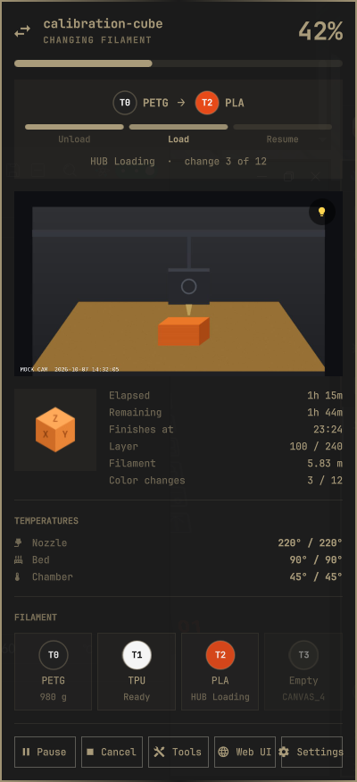

## 1. Setup and connection

### Not configured

The first time the widget loads there is no URL. The chip shows a dimmed
printer icon, and the popup opens straight on the Settings form.

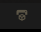

### Unreachable

The URL doesn't answer, or a request takes longer than 10 seconds. Causes
include a wrong address, the printer being off, or the VPN being down. The
chip dims and shows a disconnected-network icon.

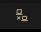

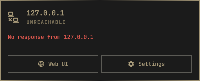

### API key missing

Moonraker answered `401` and no key is set. The chip shows a lock, and the
popup opens on Settings with the reason.

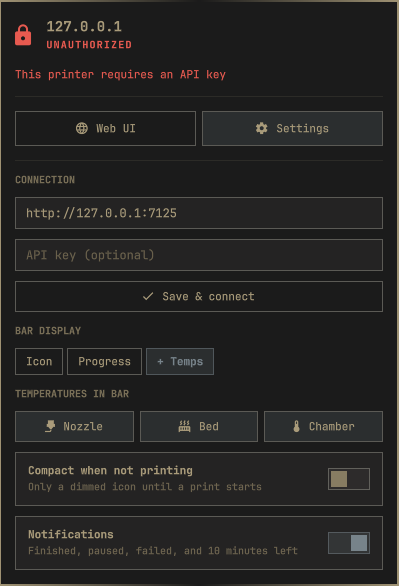

### API key rejected

Moonraker answered `401` and a key was sent, so the key is wrong.

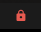

## 2. Klipper not ready

Moonraker is reachable but Klipper isn't. The chip shows an alert in the urgent
color. Temperatures stay visible whenever Klipper reports them.

| State | Bar | Popup |
|-------|-----|-------|
| Starting up |  | 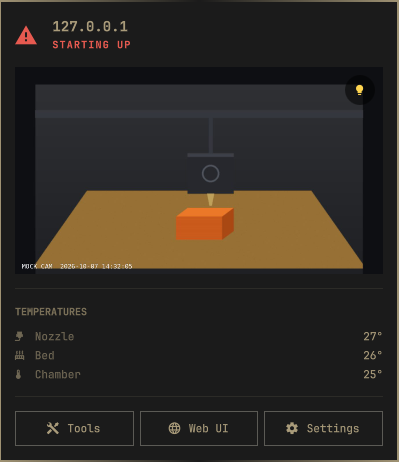 |
| Disconnected (Moonraker answers `503`) | 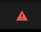 | 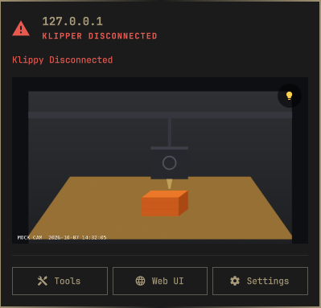 |
| Shutdown (Klipper's message is shown) |  | 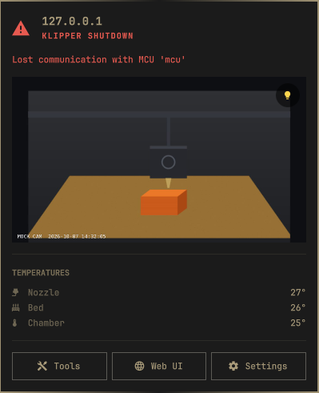 |

## 3. Print lifecycle

### Idle

Ready and nothing loaded. In `full` style the chip shows the current temperatures.

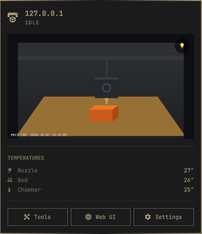

### Heating

The job has started, but `PRINT_START` is still bringing a heater up (progress
is 0 and a heater is more than 2° below its target). The chip shows
**Heating** instead of `0%`.

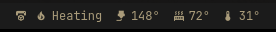

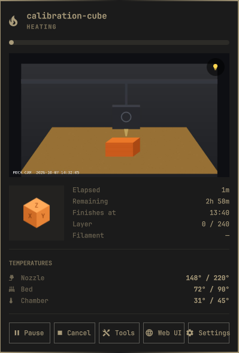

### Printing

Progress, time left, and finish time. Time left averages the slicer estimate
with extrapolation from file progress. Before 5% progress only the slicer
estimate is used.

| Progress | Bar | Popup |
|----------|-----|-------|
| 3% | 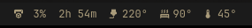 |  |
| 42% |  |  |
| 97% | 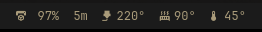 |  |

### Paused

A pause icon replaces the printer icon, and the progress bar pulses. Klipper's
pause message (e.g. a filament runout) appears under the title. **Resume**
replaces **Pause**.

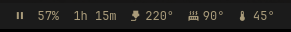

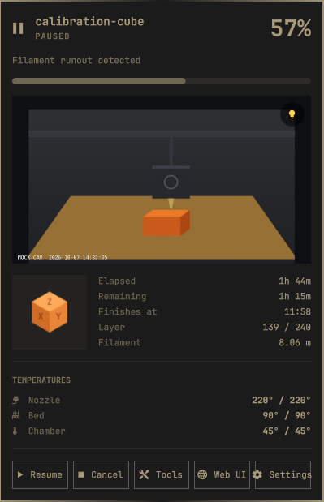

### Complete

The chip shows a check mark. The popup summarizes print time and filament used.

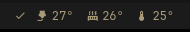

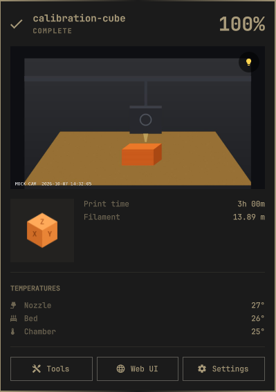

### Cancelled

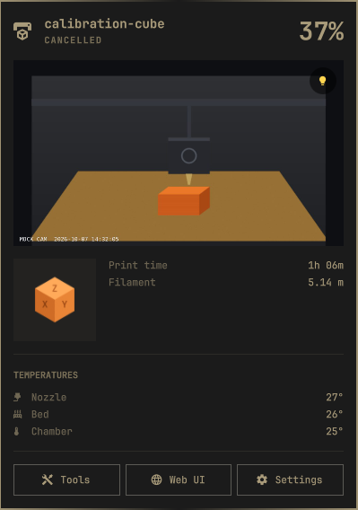

### Error

The print stopped with an error. The chip turns urgent, and the error message
appears under the title.

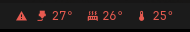

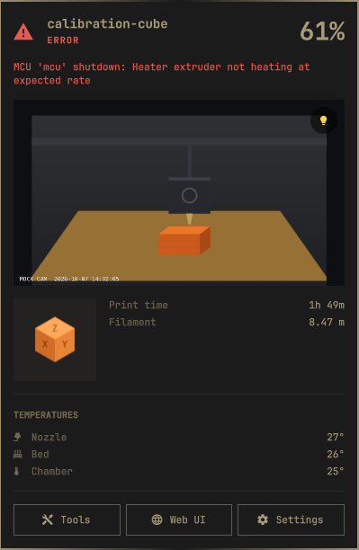

## 4. Bar styles and settings

| Style | Bar |
|-------|-----|
| `icon` |  |
| `progress` |  |
| `full` |  |
| `full`, idle |  |
| Idle with **Compact when not printing** (a dimmed icon that stays clickable) |  |

Settings open on top of a running print. The API key field is masked.

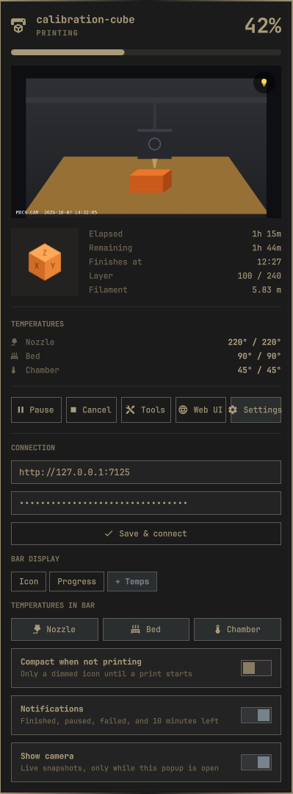
